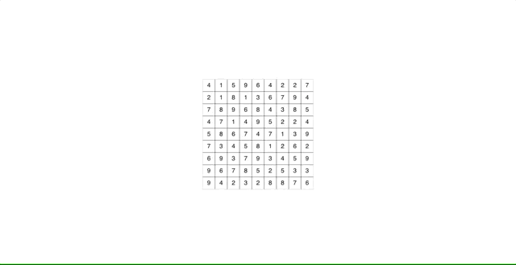

# Hitori

  

### Rules:
<ul>
<li>Color cells so numbers appear no more than once in a row or column</li>
<li>The sides of black cells never touch</li>
<li>White cells form a continuous network</li>
</ul>  

### Commands:

- "a" for:
    1. automatically circle cells around black cells
    2. automatically blacken white cells with the same number of 
        another circled cell in the same row or column

- "r" to see the resolved board (double press to reset)

- "h" gives you the next move automatically
